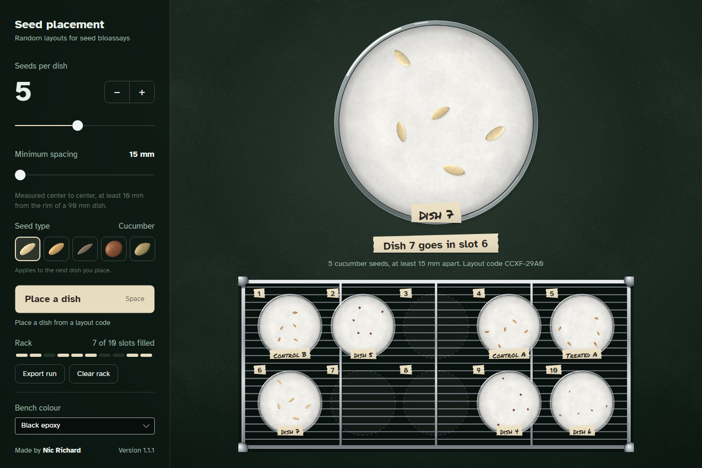
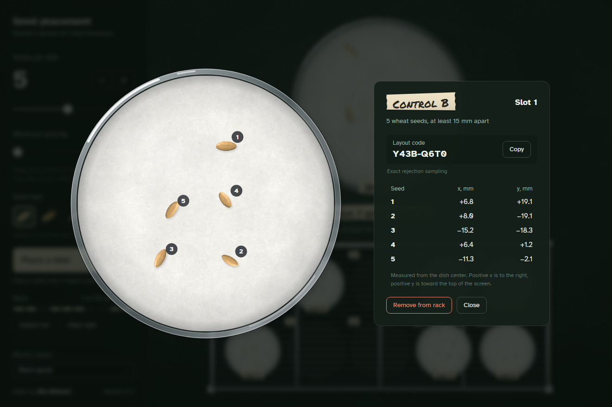

# Seed Placement Randomizer

A desktop app that removes unconscious bias from seed bioassays. It places seeds at random inside a
petri dish, then puts each dish in a random slot on a 10-slot rack. It runs offline on Windows,
macOS and Linux, and is built to be shown on a projector as well as used at the bench.



## What it does

- Places 1–10 seeds in a 90 mm dish, at least 15–20 mm apart and 10 mm from the rim
- Shelves each new dish in a random empty slot on a 2 × 5 rack, numbered from the top left
- Gives every dish a layout code, such as `RS8V-BTJ0`. Enter a code to place that exact dish again
- Labels each dish on a strip of tape. Click the label to rename a dish, such as "Control A"
- Opens any dish in an inspector with numbered seeds and their coordinates in millimetres
- Records a seed type for each dish (cucumber, wheat, lettuce, radish or barnyard grass) and draws
  its seeds to scale, so concurrent experiments can share one rack. The type never changes placement
- Exports a run as a CSV of seed positions, a picture of the rack, and printable 1:1 templates to
  set each dish on
- Saves the run as you go and restores it the next time the app opens
- Removes single dishes or clears the rack for the next run



## How the placement stays random

Seed positions are drawn uniformly over the area of the dish. A layout is kept only if every seed
meets the spacing and rim rules; otherwise the whole layout is redrawn. Rejecting whole layouts
rather than nudging individual seeds makes every valid arrangement equally likely. The shortcut of
placing seeds one by one and skipping bad spots quietly favours some patterns over others.

For very crowded settings, such as 10 seeds at 20 mm, whole-layout redraws become too slow. There
the app switches to a Markov chain that samples the same distribution. The inspector names the
method used for each dish.

Each new dish goes into a uniformly random empty slot, so every assignment of dishes to slots is
equally likely.

Layout codes use a PRNG specified in the source (xoshiro256**) rather than the runtime's, so a code
produces the same dish on any machine and any future version. The test suite checks the spacing
and rim rules, uniformity (chi-square), agreement between the two samplers, and fixed outputs for
known codes.

## Running it

Download the latest build from the [Releases page](https://github.com/Nic-Richard/seed-placement-randomizer/releases).

- **Windows:** run `SeedPlacementRandomizer-<version>-win-x64.exe`. No installation is needed.
  Windows may warn about an unknown publisher because the app isn't code-signed: choose
  **More info**, then **Run anyway**.
- **macOS:** unzip the build for your Mac (`osx-arm64` for Apple silicon, `osx-x64` for Intel) and
  move the app to Applications. The first time, right-click it and choose **Open**.
- **Linux:** extract `SeedPlacementRandomizer-<version>-linux-x64.tar.gz` and run
  `./SeedPlacementRandomizer`. It is self-contained and needs no .NET install.

Print templates at actual size (100%). Each page has a line that should measure 50 mm.

### Building from source

Requires the [.NET 10 SDK](https://dotnet.microsoft.com/download).

```sh
dotnet run --project src/SeedPlacement.App
dotnet test
```

Publish a self-contained single-file build for Windows, or package the macOS app on a Mac:

```sh
dotnet publish src/SeedPlacement.App -c Release -r win-x64 -o publish/win-x64
packaging/macos/package.sh osx-arm64 1.0.0 dist
```

Pushing a tag such as `v1.0.0` builds both platforms on GitHub Actions and opens a draft release
using the notes in `docs/releases/`.

## Repository structure

```text
src/SeedPlacement.Core/        Geometry, PRNG, sampling, layout codes, rack assignment
src/SeedPlacement.App/         Avalonia desktop app: views, view models, drawing, motion
tests/SeedPlacement.Tests/     Tests for Core, including statistical checks
tools/SeedPlacement.Snapshots/ Renders the app offscreen to refresh the screenshots
assets-src/                    Script that generates the seed, paper, bench grain and icon images
packaging/macos/               App bundle template, icon and packaging script
docs/                          Release notes and README screenshots
```

Regenerate the images with `python assets-src/generate_assets.py` (numpy, scipy, Pillow), and the
screenshots with `dotnet run --project tools/SeedPlacement.Snapshots`.

## License

[PolyForm Noncommercial 1.0.0](LICENSE.md). Anyone can use, share and modify it for noncommercial
purposes, including research, teaching and personal use. Selling it or using it commercially needs
permission.

## Credits

Made by **[Nic Richard](https://github.com/Nic-Richard)**. Commissioned for a seed germination bioassay.

Set in [Atkinson Hyperlegible](https://www.brailleinstitute.org/freefont/) (SIL Open Font License), with
labels in [Permanent Marker](https://fonts.google.com/specimen/Permanent+Marker) (Apache License 2.0). Built with
[Avalonia](https://avaloniaui.net).
